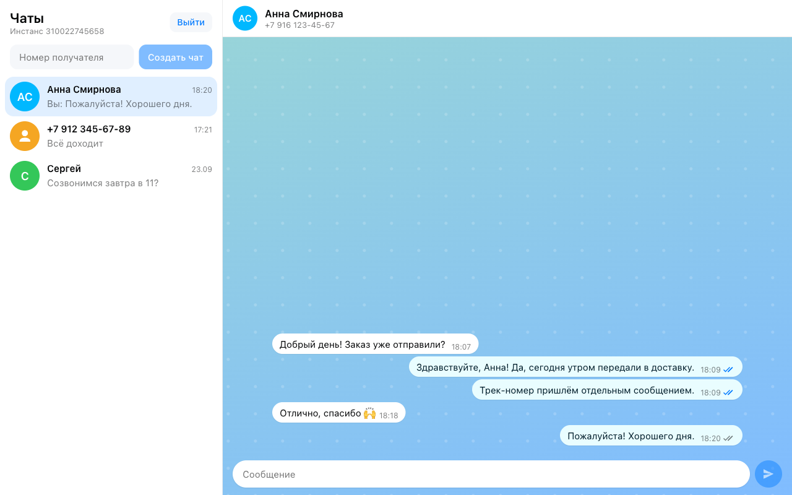
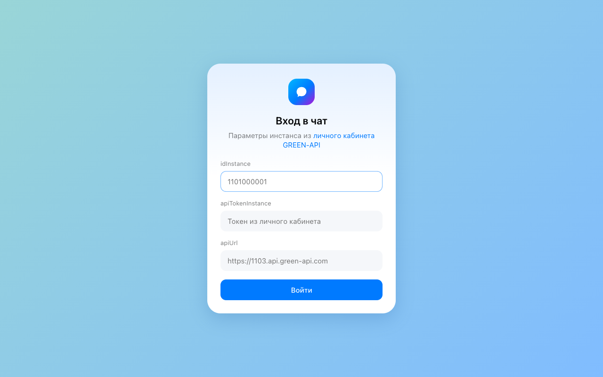
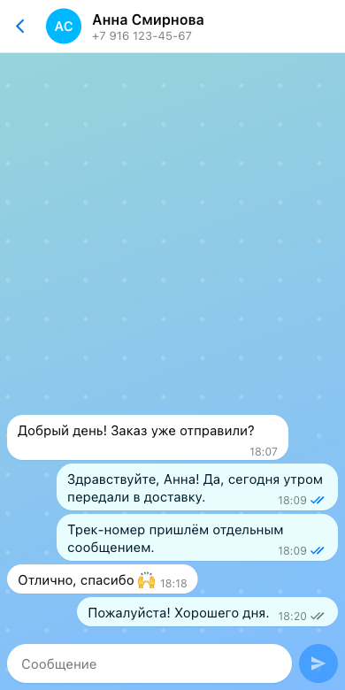

# Чат для MAX на GREEN-API

Тестовое задание на позицию «Фронтенд-разработчик React» в GREEN-API: минимальный веб-чат для
отправки и получения текстовых сообщений в мессенджере [MAX](https://green-api.com/max) через
[HTTP API GREEN-API](https://green-api.com/v3/docs/). Внешний вид повторяет [web.max.ru](https://web.max.ru/).

**Демо:** https://green-api-max-chat-malik.vercel.app



| Вход                                | Телефон                                 |
| ----------------------------------- | --------------------------------------- |
|  |  |

## Как пользоваться

1. Введите `idInstance` и `apiTokenInstance` своего инстанса. `apiUrl` подставится сам
   по номеру инстанса (`https://3100.api.green-api.com` для `3100…`), его можно поправить руками.
2. Введите номер получателя (`+7 999 123-45-67`, `8 999 …` — любой привычный формат) и нажмите
   «Создать чат».
3. Напишите сообщение и нажмите Enter (Shift+Enter — перенос строки).
4. Когда получатель ответит в MAX, ответ появится в этом же чате.

## Запуск

Нужен любой из вариантов, каждый — одна команда.

### 1. Docker

```bash
git clone https://github.com/airmalik0/green-api-max-chat.git
cd green-api-max-chat
docker compose up --build
```

Откройте http://localhost:8080. Если порт занят: `PORT=3000 docker compose up --build`.

### 2. Node.js (20.19+ или 22+)

```bash
git clone https://github.com/airmalik0/green-api-max-chat.git
cd green-api-max-chat
npm install
npm run dev
```

Откройте http://localhost:5173.

### 3. Vercel

```bash
vercel --prod
```

Настроек не нужно: `vercel.json` уже описывает сборку. Бэкенд и переменные окружения не нужны —
GREEN-API отдаёт CORS-заголовки, и браузер обращается к API напрямую.

## Где взять idInstance и apiTokenInstance

1. Зарегистрируйтесь в [личном кабинете GREEN-API](https://console.green-api.com).
2. Создайте инстанс с тарифом **MAX: Developer** (бесплатный). Если в списке тарифов нет MAX,
   укажите в профиле кабинета страну «Россия».
3. Авторизуйте инстанс: в приложении MAX откройте «Профиль → Устройства → Войти по QR-коду»
   и отсканируйте QR со страницы инстанса.
4. Скопируйте со страницы инстанса `idInstance`, `apiTokenInstance` и `apiUrl`.

У нового инстанса все уведомления выключены. При входе приложение проверяет настройки через
`getSettings` и, если нужно, включает приём входящих сообщений и статусов (`setSettings`:
`incomingWebhook`, `outgoingWebhook`, пустой `webhookUrl`). GREEN-API применяет новые настройки
в течение нескольких минут — первые входящие могут прийти с задержкой.

## Что реализовано по пунктам задания

| Пункт задания                                            | Где в коде                                                                                                                                                                                |
| -------------------------------------------------------- | ----------------------------------------------------------------------------------------------------------------------------------------------------------------------------------------- |
| Ввод `idInstance` и `apiTokenInstance`                   | [`LoginScreen.tsx`](src/components/LoginScreen.tsx) — проверка через `getStateInstance`, понятные ошибки для неверных кредов и неавторизованного инстанса                                 |
| Ввод номера получателя и создание чата                   | [`NewChatForm.tsx`](src/components/NewChatForm.tsx), [`phone.ts`](src/lib/phone.ts) — нормализация номера; [`resolveChatId.ts`](src/lib/resolveChatId.ts) — `chatId` через `CheckAccount` |
| Отправка текста — `SendMessage`                          | [`ChatScreen.tsx`](src/components/ChatScreen.tsx) `sendMessage`, [`greenApi.ts`](src/api/greenApi.ts), [`Composer.tsx`](src/components/Composer.tsx)                                      |
| Получение — `ReceiveNotification` + `DeleteNotification` | [`notificationLoop.ts`](src/lib/notificationLoop.ts), [`useNotificationPolling.ts`](src/hooks/useNotificationPolling.ts)                                                                  |
| Ответ собеседника виден в чате                           | [`chatReducer.ts`](src/state/chatReducer.ts) — обработка `incomingMessageReceived` и статусов `outgoingMessageStatus`                                                                     |
| Внешний вид как у web.max.ru                             | [`index.css`](src/index.css) (палитра MAX), CSS-модули компонентов                                                                                                                        |
| React                                                    | React 19 + TypeScript + Vite                                                                                                                                                              |

Сверх минимума — только то, без чего чатом неудобно пользоваться: время и статус сообщения
(отправляется / отправлено / доставлено / прочитано / ошибка), сохранение кредов и истории
в `localStorage`, кнопка «Выйти», адаптивная вёрстка до ширины телефона.

## Как устроен приём сообщений

```
┌─► receiveNotification?receiveTimeout=20   (long polling: сервер держит запрос до 20 с)
│        │ пусто ────────────────────────────────┐
│        ▼ уведомление                           │
│   текстовое входящее → в чат (новый номер → новый чат)
│   статус отправленного → обновить галочки      │
│   всё остальное → пропустить                   │
│        ▼                                       │
│   deleteNotification/{receiptId}  (всегда, иначе очередь встанет)
└────────┴───────────────────────────────────────┘
```

- Ошибка сети или 5xx — повтор с паузой 1 → 2 → 4 … 30 с, на 429 — не меньше 5 с.
  Пока связи нет, в сайдбаре висит плашка с причиной.
- 401/403 — цикл останавливается: креды больше не действуют.
- При «Выйти» и размонтировании текущий long-polling запрос отменяется через `AbortController`.
- Одно и то же уведомление может прийти дважды (если `deleteNotification` не дошёл) — сообщения
  дедуплицируются по `idMessage`.

**Про `chatId` в MAX.** В GREEN-API v3 отправка идёт по числовому `chatId` пользователя MAX,
а входящие приходят с ним же. Поэтому чат по номеру создаётся через `CheckAccount`, как
рекомендует документация: получаем `chatId` и сразу видим понятную ошибку, если у номера нет MAX.
Если у инстанса метода `CheckAccount` нет (ответ 404 — например, у WhatsApp-инстанса), используется классический `79991234567@c.us`.

## Структура

```
src/
├── api/
│   ├── greenApi.ts          клиент HTTP API и разбор ошибок
│   └── types.ts             типы запросов и уведомлений
├── components/              экраны и компоненты (CSS-модули рядом)
│   ├── LoginScreen.tsx      вход и проверка инстанса
│   ├── ChatScreen.tsx       связывает состояние, API и polling
│   ├── Sidebar.tsx          список чатов, «Выйти», статус связи
│   ├── NewChatForm.tsx      создание чата по номеру
│   ├── ChatView.tsx         шапка и лента сообщений
│   ├── MessageBubble.tsx    сообщение со временем и статусом
│   └── Composer.tsx         поле ввода, Enter — отправка
├── hooks/useNotificationPolling.ts   жизненный цикл цикла приёма
├── lib/
│   ├── notificationLoop.ts  receive → обработка → delete, backoff
│   ├── ensureReceiving.ts   включение уведомлений в настройках инстанса
│   ├── resolveChatId.ts     номер → chatId
│   ├── phone.ts, time.ts    форматирование
│   └── storage.ts           localStorage
└── state/chatReducer.ts     чаты и сообщения (useReducer)
```

## Проверки

```bash
npm run lint        # ESLint
npm run typecheck   # TypeScript
npm test            # Vitest + Testing Library
npm run build
```

Тесты покрывают клиент API, нормализацию номера, редьюсер (входящие, статусы, дедупликация,
новый чат от незнакомого номера), цикл приёма (удаление уведомлений, backoff, 429, 401, отмена)
и сквозной сценарий в UI: вход → чат по номеру → отправка → ответ собеседника → «Выйти».
Те же проверки гоняет GitHub Actions на каждый push.

## Ограничения

- Только текстовые сообщения; фото, стикеры и прочие типы уведомлений удаляются из очереди
  без показа.
- История хранится в браузере: GREEN-API не отдаёт её этим методам, а бэкенда у приложения нет.
- `apiTokenInstance` лежит в `localStorage` этого браузера и никуда, кроме GREEN-API,
  не отправляется. «Выйти» стирает креды и историю.
- По номеру телефона MAX принимает только номера России и Беларуси (`7…`, `375…`) —
  это ограничение `CheckAccount`.
